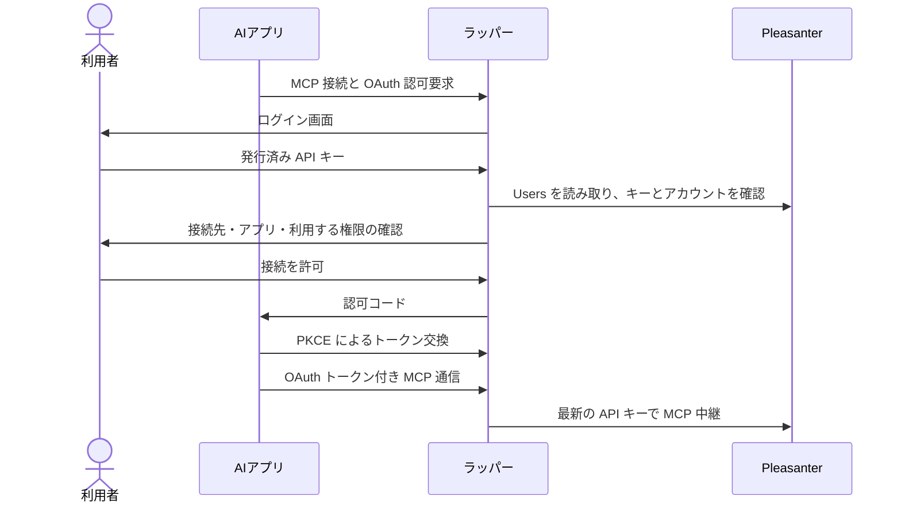
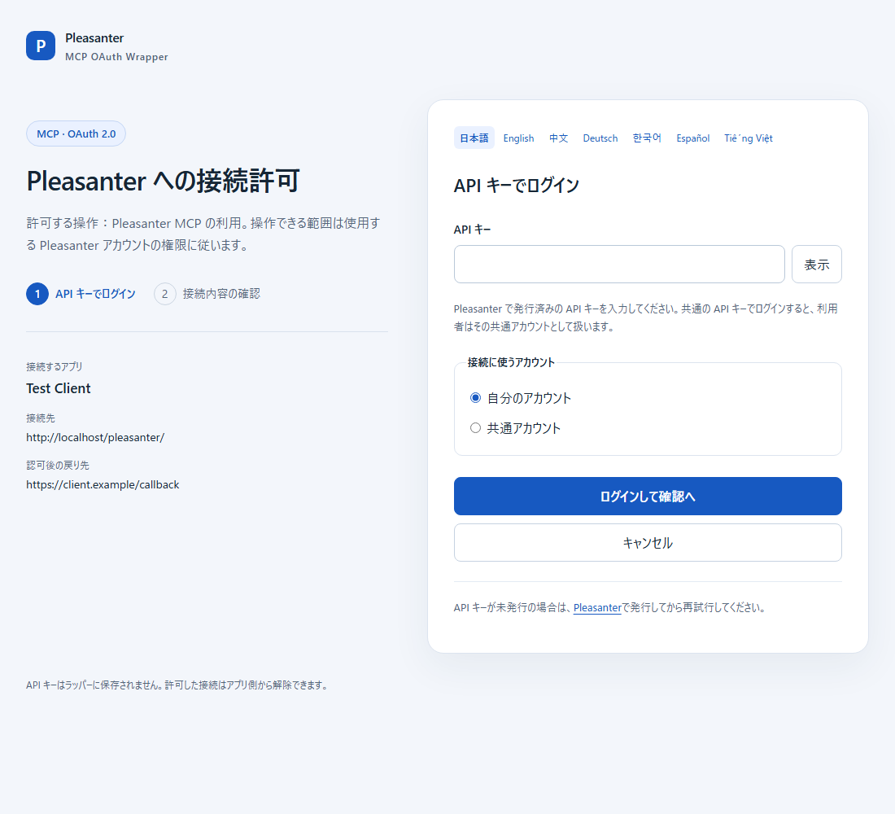
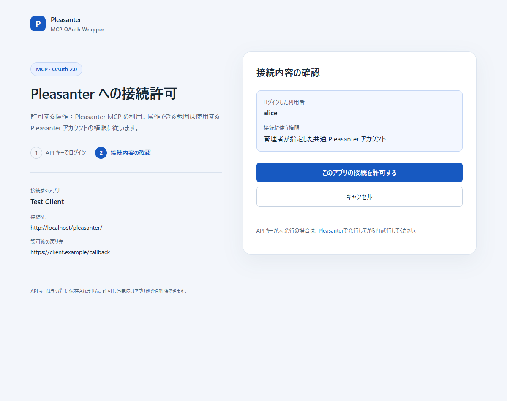
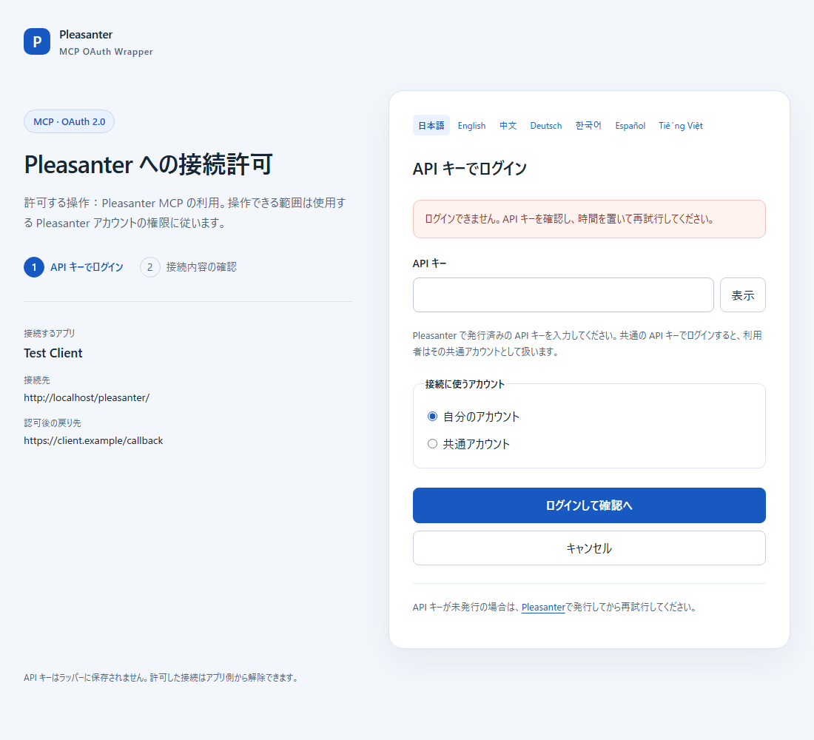
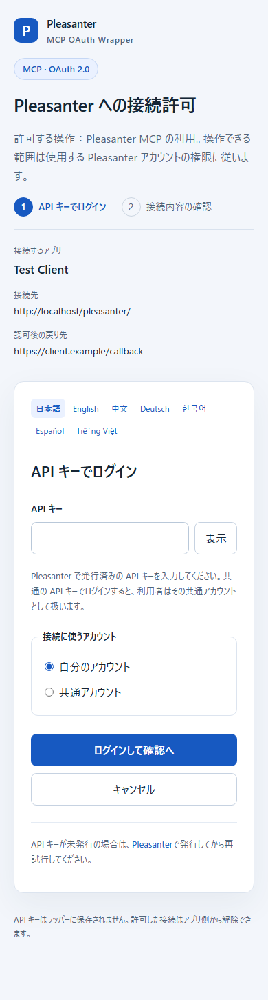

# 接続の流れと画面

接続前に Pleasanter で API キーを発行してください。本書のログイン画面・エラー画面・モバイル画面は、合成 Users を使った HTTP テストでラッパーが生成した HTML をブラウザーで描画したものです。同意画面は従来の合成データ検証環境で撮影したラッパーです。AI アプリ側の画面は製品や組織設定によって異なります。

## 1. ログイン

AI アプリでコネクタを接続すると、この画面へ移ります。発行済みの API キーを入力し、使用するアカウントを選びます。共通アカウントの選択肢は管理者が設定した場合だけ表示されます。

共有された API キーそのものを入力した場合、識別される利用者もその共有アカウントです。個人のキーでログインして共通アカウントの権限を選ぶ場合とは異なります。

## 2. 接続を許可

接続するアプリ、接続先、利用者と使用する権限を確認して「このアプリの接続を許可する」を押します。API キーは確認画面に表示しません。

共通アカウントを選んだ場合は、利用する権限の表示が変わります。操作は共通アカウントの権限で行われます。

許可すると AI アプリへ戻り、接続が完了します。「キャンセル」は接続を拒否して AI アプリへ戻ります。キーが未発行なら、画面下の Pleasanter リンクから発行して再接続してください。

## 3. ログインできない場合

API キーが未発行のアカウントは、最初のログイン認証を通りません。入力したキーから利用者を検索するため、未発行・削除済み・入力間違いは同じログインエラーになります。無効なアカウントなども拒否します。失敗が続いた場合は15分待ってから再試行してください。

個人キーで認証した後でも、選択した共通アカウントのキーが未発行の場合は発行案内が表示されます。共通アカウントの設定・キー発行は管理者へ確認してください。

キーを再発行・削除した場合、次の MCP 通信やトークン更新は拒否されます。新しいキーで AI アプリのコネクタを接続し直してください。開始済みの長時間通信をその場で停止する機能はありません。

## 表示言語

日本語・英語・中国語・ドイツ語・韓国語・スペイン語・ベトナム語に対応します。初期表示はブラウザーの言語を参照し、対応言語がない場合は日本語になります。画面上部のリンクで切り替えられ、ログイン後の同意やエラーも同じ言語を使用します。

| 言語 | 画面例 |
| --- | --- |
| 日本語 | [画面](images/login-ja.png) |
| English | [画面](images/login-en.png) |
| 中文 | [画面](images/login-zh.png) |
| Deutsch | [画面](images/login-de.png) |
| 한국어 | [画面](images/login-ko.png) |
| Español | [画面](images/login-es.png) |
| Tiếng Việt | [画面](images/login-vi.png) |

## モバイル表示

狭い画面では接続先と認証カードを縦に並べます。API キー欄の「表示／隠す」で入力内容を確認できます。キーを表示したまま画面を離れた場合は入力と表示状態を残しません。

Claude・ChatGPT の登録操作は [AI アプリ接続手順](AIアプリ接続手順.md) を参照してください。ここに掲載している画像は合成データを使った検証環境のラッパー画面です。
